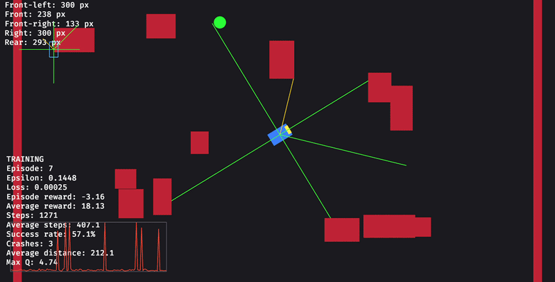

# Autonomous Car RL in Rust and Bevy

<p align="center">
  
  
  
  
</p>

A lightweight 2D autonomous parking agent built entirely from scratch in **Rust** with the **Bevy Engine (ECS)**. The agent uses a multilayer perceptron (MLP) and a custom **Deep Q-Network (DQN)** training loop to learn how to park in procedurally generated environments.

<p align="center">
  
</p>

No Python bindings, PyTorch, or external RL frameworks are used. The neural network, gradient updates, replay buffer, sensor processing, environment generation, and car dynamics are implemented in native Rust.

## Features
- MLP neural network implemented from scratch in Rust
- DQN training with experience replay and a target network
- Ray-based lidar sensing for environment perception
- Custom 2D car dynamics and collision detection
- Procedurally randomized maps and parking goals
- Custom reward shaping for autonomous parking
- Model serialization and greedy inference from saved models
- Real-time simulation and visualization using Bevy ECS

## Requirements

- Rust toolchain with Cargo
- A desktop environment capable of running a Bevy window

## Running the project

Run a new training session with a randomly initialized model:

```bash
cargo run
```

Continue training from a saved model:

```bash
cargo run -- --model=path/to/model.bin --train
```

Start inference with a saved model:

```bash
cargo run -- --model=path/to/model.bin
```

Set the initial exploration rate when training:

```bash
cargo run -- --model=path/to/model.bin --train --epsilon=0.5
```

Training saves the best model to `checkpoints/best_model.bin` once the rolling success-rate window is full.

## Controls

- **Space** — In inference mode, abandon the current episode, count it as a crash, generate a new map, and reset the car.

The agent controls the car automatically. The keyboard controls in `controls.rs` are retained for development experiments but are not part of the default agent loop.

## Architecture at a glance

- **Environment** — Bevy entities represent the car, walls, sensors, and parking goal. Each episode uses a randomized map and goal.
- **Observation** — Six normalized lidar distances, normalized speed, normalized distance to the goal, and normalized relative angle form a 9-value state vector.
- **Policy** — The MLP maps the state to five Q-values corresponding to discrete car actions.
- **Training** — The DQN trainer uses epsilon-greedy exploration, a replay buffer, Bellman targets, Huber loss, gradient clipping, and periodic target-network updates.
- **Inference** — A saved model selects the action with the highest Q-value without exploration.

Detailed implementation notes can live in separate documentation files as the project evolves. Useful topics include the neural-network implementation, DQN update equations, reward design, and experiment results.

## Results

The project currently provides the simulation and live episode metrics, including episode count, success rate, crashes, and average steps. Add benchmark values here once they are measured with a fixed model, number of episodes, and map-generation conditions.

## Tech stack

- **Rust 2024** — Application, agent, neural network, and simulation logic
- **Bevy 0.19** — ECS scheduling, windowing, rendering, and application loop
- **rand 0.10** — Procedural map and goal generation

The project uses custom car movement and collision code rather than a separate physics engine.

## License

This project is licensed under the MIT License. See [LICENSE](LICENSE).