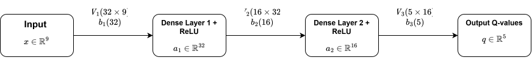

## Model Architecture

The agent's action-value function is powered by a custom **Multi-Layer
Perceptron (MLP)** written in pure Rust without external linear algebra crates.

### Network Topology

---

### Input State Vector Encoding ($S \in \mathbb{R}^9$)

The model expects exactly nine `f32` values. The state encoder scales the
features to approximately $[-1, 1]$ or $[0, 1]$:

| Index | Feature | Range | Normalization Formula |
| :---: | :--- | :---: | :--- |
| **0 – 5** | **Lidar Distances** | $[0.0, 1.0]$ | $d_i / d_{\text{max}}$ |
| **6** | **Vehicle Speed** | approximately $[-0.4, 1.0]$ | $v_{\text{car}} / v_{\text{max}}$; reverse speed is limited to $-0.4v_{\text{max}}$ |
| **7** | **Distance to Goal** | $[0.0, 1.0]$ | $\text{clamp}(d_{\text{goal}} / \sqrt{\text{width}^2 + \text{height}^2}, 0, 1)$ |
| **8** | **Relative Angle to Goal** | $[-1.0, 1.0]$ | $(\theta_{\text{goal}} - \theta_{\text{car}}) / \pi$, wrapped to $[-\pi, \pi]$ |

The heading used by the implementation includes a $\pi/2$ sprite-orientation
offset before calculating the relative angle. The distance normalization uses
the fixed map diagonal (`1280 x 720`) currently defined in the state encoder.
Lidar distances are divided by the sensor's configured maximum distance.

See [state.rs](../src/agent/state.rs) for the authoritative vector encoding.

---

### Output Q-Value Vector ($Q(s, \cdot) \in \mathbb{R}^5$)

The output layer produces one raw $Q$-value for each action in the discrete
action space. Greedy inference selects the action with $\arg\max$ Q-value:

| Index | Action Enum | Discrete Control Mapping |
| :---: | :--- | :--- |
| `0` | `CarAction::Neutral` | Coasting / No Throttle |
| `1` | `CarAction::Forward` | Accelerate Forward |
| `2` | `CarAction::ForwardLeft` | Turn Steering Wheel Left + Accelerate |
| `3` | `CarAction::ForwardRight` | Turn Steering Wheel Right + Accelerate |
| `4` | `CarAction::BrakeReverse` | Brake / Reverse |

See [state.rs](../src/agent/state.rs) for the authoritative action mapping.

---

### Network Definition

The network is a fully connected feed-forward value network:

| Layer | Input size | Output size | Activation |
| :--- | :---: | :---: | :--- |
| Dense 1 | 9 | 32 | ReLU |
| Dense 2 | 32 | 16 | ReLU |
| Output | 16 | 5 | Linear |

For each linear layer with weights $W$, bias $b$, and input $x$:
$$z = W x + b$$
$$a = \text{ReLU}(z) = \max(0, z)$$

The output layer uses a pure linear activation (no activation function) and
returns one unconstrained scalar per action. The selected action is the index
of the largest output during greedy inference. The network therefore models
action values rather than probabilities; it does not contain a separate policy
head.

The layer parameter shapes are:

- $W_1 \in \mathbb{R}^{32 \times 9}$, $b_1 \in \mathbb{R}^{32}$
- $W_2 \in \mathbb{R}^{16 \times 32}$, $b_2 \in \mathbb{R}^{16}$
- $W_3 \in \mathbb{R}^{5 \times 16}$, $b_3 \in \mathbb{R}^{5}$

There are 933 trainable scalar parameters in total. See
[model.rs](../src/agent/model.rs) for the implementation.

---

### Binary Model Serialization

The weights and biases are stored as raw little-endian `f32` values in this
fixed order:

1. `W1` (288 values)
2. `b1` (32 values)
3. `W2` (512 values)
4. `b2` (16 values)
5. `W3` (80 values)
6. `b3` (5 values)

The resulting file is 933 values (3,732 bytes). The format has no header,
version, shape metadata, or checksum; the loader therefore requires the exact
architecture and byte order described above. Serialization is used for both
inference and training, while the RL/DQN training procedure is documented
separately.