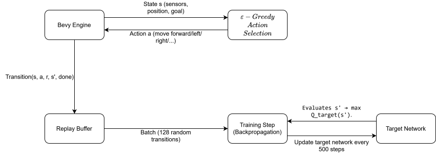

## Deep Q-Learning (DQN) Training Architecture

The training pipeline uses a **Deep Q-Network (DQN)** with experience replay,
a periodically synchronized target network, and an $\varepsilon$-greedy
exploration policy. The model architecture and state encoding are documented
separately in [MODEL_ARCHITECTURE.md](./MODEL_ARCHITECTURE.md).

> **How to read the diagram:** Bevy produces the current state $s$, the agent
> selects an action, and the environment returns a transition
> $(s, a, r, s', \text{done})$. Transitions are stored in the replay buffer.
> Random samples from that buffer are used by the online network for training;
> the target network estimates the next-state value and is periodically
> synchronized with the online network. The diagram's “sensors, position,
> goal” label is a conceptual description of the environment state; the exact
> nine-value input encoding is defined in
> [MODEL_ARCHITECTURE.md](./MODEL_ARCHITECTURE.md).

---

### Notation and Parameter Glossary

| Symbol | Meaning |
| :--- | :--- |
| $s$ | Current state vector, containing nine normalized values |
| $s'$ | State after the selected action is applied |
| $a$ | Discrete action index, from `0` to `4` |
| $a'$ | Candidate next action used when selecting the largest next Q-value |
| $r$ | Scalar reward returned by the environment |
| $\text{done}$ | `true` when the transition ends an episode |
| $Q(s,a)$ | Online network's estimated value for action $a$ in state $s$ |
| $Q_{\text{target}}(s',a')$ | Target network's estimated next-state value |
| $Y$ | Bellman target used to train the online network |
| $\gamma$ | Discount factor for future rewards |
| $\varepsilon$ | Probability of selecting a random action |
| $\theta_{\text{online}}$ | Parameters of the trainable online network |
| $\theta_{\text{target}}$ | Parameters of the target network |
| $N$ | Number of transitions sampled for one training step |

The **online network** is updated by backpropagation. The **target network**
is a delayed copy used only to compute stable next-state targets. The reward
calculation itself is intentionally not specified here; it will be documented
and experimented with separately.

---

### 1. Environment Interaction and Experience Replay

Each environment step produces a transition:

$$T = (s, a, r, s', \text{done})$$

where:

- $s$ and $s'$ are nine-value state vectors.
- $a$ is the executed action index in $\{0,\ldots,4\}$.
- $r$ is the scalar reward returned by the environment.
- `done` indicates whether the episode terminated.

Transitions are stored in the cyclic [`ReplayBuffer`](../src/agent/train.rs).
When the buffer is full, the next insertion overwrites the oldest entry.
Training starts once at least `BATCH_SIZE` transitions are available.

The default buffer capacity is `10,000` transitions for a new training run and
`50,000` when training is resumed from a saved model. Each training step
randomly samples $N=128$ transitions. The sampled transitions are processed
sequentially during that step.

---

### 2. Bellman Target and Training Step

For each sampled transition, the target value is:

$$
Y =
\begin{cases}
r & \text{if } \text{done} \\
\operatorname{clamp}\left(
r + \gamma \max_{a'} Q_{\text{target}}(s',a'),
-Q_{\max}, Q_{\max}
\right) & \text{otherwise}
\end{cases}
$$

The implementation uses:

- $\gamma=0.99$ (`GAMMA`) as the discount factor.
- $Q_{\max}=100.0$ (`MAX_TARGET_Q`) as the target clipping limit.
- The target network for both the next-state evaluation and the `max`
  operation. This is standard DQN target selection, not Double DQN.

Only the Q-value corresponding to the executed action is replaced by $Y$.
The other output values remain equal to their current predictions:

$$
\mathbf{y} = Q_{\text{online}}(s,\cdot), \qquad y_a \leftarrow Y
$$

The online network then performs one backpropagation update using this target
vector. The loss returned for a training step is the average of the per-sample
losses. The Huber loss and gradient clipping used by the network are described
in the optimization section below.

---

### 3. Target Network Synchronization

To reduce instability caused by a moving target, the target network is copied
from the online network every 500 training steps:

$$
\theta_{\text{target}} \leftarrow \theta_{\text{online}}
\quad\text{every `TARGET_UPDATE_INTERVAL = 500` steps}
$$

Between synchronizations, the target network remains unchanged while the
online network continues learning.

---

### 4. Epsilon-Greedy Exploration

During training, the agent chooses a random action with probability
$\varepsilon$ and otherwise chooses the action with the largest online
network Q-value:

$$
a =
\begin{cases}
\text{random action} & \text{with probability } \varepsilon \\
\arg\max_a Q_{\text{online}}(s,a) & \text{with probability } 1-\varepsilon
\end{cases}
$$

The current implementation uses:

- Initial $\varepsilon_0=1.0$: all actions are random initially.
- `EPSILON_DECAY = 0.995`: multiplicative decay after each completed
  episode.
- $\varepsilon_{\min}=0.05$ (`MIN_EPSILON`): exploration never falls below
  5%.

The update is:

$$
\varepsilon_{t+1}
= \max\left(\varepsilon_t \cdot 0.995,\varepsilon_{\min}\right)
$$

Inference mode does not use epsilon exploration; it always selects the
highest-valued action.

---

### 5. Optimization Details

The network uses a Huber loss with $\delta=1.0$ for each output value:

$$
L(e)=
\begin{cases}
0.5e^2 & \text{if } |e|\le 1 \\
|e|-0.5 & \text{otherwise}
\end{cases}
\qquad
e=Q_{\text{pred}}-Q_{\text{target}}
$$

The output error derivative is clipped to $[-1,1]$. Hidden-layer derivatives
are also clipped to this interval after applying the ReLU derivative. The
network uses vanilla SGD with `LEARNING_RATE = 0.0005`:

$$
W \leftarrow W-\eta\,d\,a^\mathsf{T},
\qquad
b \leftarrow b-\eta\,d
$$

The implementation is in [`model.rs`](../src/agent/model.rs).

---

### 6. Training Hyperparameters

| Parameter | Value | Constant / Field | Meaning |
| :--- | :---: | :--- | :--- |
| Learning rate ($\eta$) | `0.0005` | `LEARNING_RATE` | SGD update size |
| Discount factor ($\gamma$) | `0.99` | `GAMMA` | Weight of future rewards |
| Batch size ($N$) | `128` | `BATCH_SIZE` | Transitions sampled per training step |
| Target update interval | `500` | `TARGET_UPDATE_INTERVAL` | Training steps between target-network copies |
| Maximum target value ($Q_{\max}$) | `100.0` | `MAX_TARGET_Q` | Bellman-target clipping limit |
| Epsilon decay | `0.995` | `EPSILON_DECAY` | Per-episode multiplicative decay |
| Minimum epsilon ($\varepsilon_{\min}$) | `0.05` | `MIN_EPSILON` | Minimum random-action probability |
| Replay capacity | `10,000` / `50,000` | `buffer_capacity` | New run / resumed training |
| Gradient clip limit | `1.0` | `GRADIENT_CLIP` | Absolute derivative limit |

Reward values, terminal conditions, and reward-shaping experiments are not
defined in this document. They should be documented in a separate reward
calculation document so that changes to the reward design do not get confused
with changes to the DQN algorithm.
